# RealWorld App 설계 문서

> 이 문서는 RealWorld 앱의 시스템 아키텍처, 데이터 모델, API 설계 및 컴포넌트 구조를 정의합니다.

---

## 1. 시스템 아키텍처

### 1.1 전체 시스템 구조

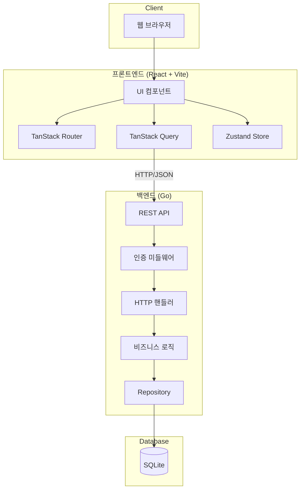

### 1.2 요청 흐름

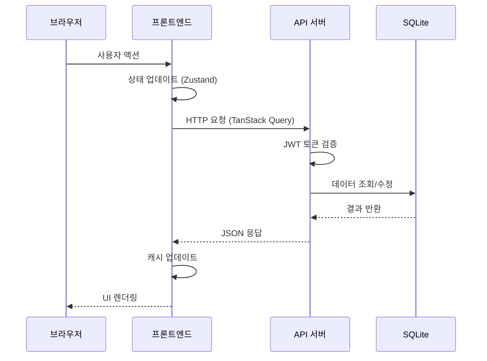

---

## 2. 백엔드 설계

### 2.1 디렉토리 구조

```
backend/
├── cmd/
│   └── server/
│       └── main.go           # 애플리케이션 엔트리포인트
├── internal/
│   ├── config/
│   │   └── config.go         # 환경 설정
│   ├── handler/
│   │   ├── user.go           # 사용자 핸들러
│   │   ├── article.go        # 게시글 핸들러
│   │   ├── comment.go        # 댓글 핸들러
│   │   ├── profile.go        # 프로필 핸들러
│   │   └── tag.go            # 태그 핸들러
│   ├── middleware/
│   │   ├── auth.go           # JWT 인증
│   │   ├── cors.go           # CORS 설정
│   │   └── logger.go         # 요청 로깅
│   ├── model/
│   │   ├── user.go           # 사용자 모델
│   │   ├── article.go        # 게시글 모델
│   │   ├── comment.go        # 댓글 모델
│   │   └── tag.go            # 태그 모델
│   ├── repository/
│   │   ├── user.go           # 사용자 DB 접근
│   │   ├── article.go        # 게시글 DB 접근
│   │   ├── comment.go        # 댓글 DB 접근
│   │   └── tag.go            # 태그 DB 접근
│   └── service/
│       ├── user.go           # 사용자 비즈니스 로직
│       ├── article.go        # 게시글 비즈니스 로직
│       └── auth.go           # 인증 로직
├── pkg/
│   ├── jwt/
│   │   └── jwt.go            # JWT 유틸리티
│   ├── password/
│   │   └── password.go       # bcrypt 래퍼
│   └── slug/
│       └── slug.go           # Slug 생성 유틸리티
├── db/
│   ├── migrations/           # 마이그레이션 파일
│   └── queries/              # sqlc 쿼리
├── go.mod
└── go.sum
```

### 2.2 계층 구조

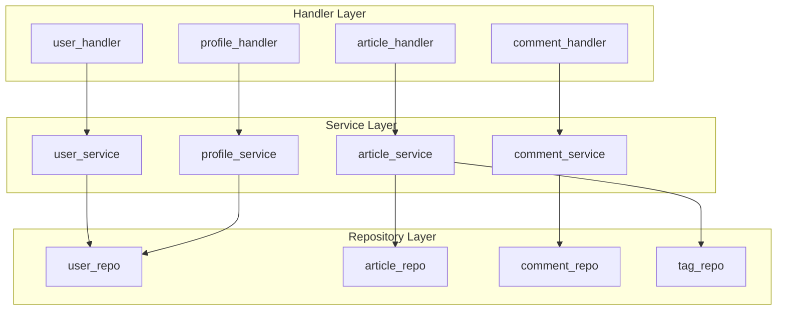

### 2.3 인증 흐름

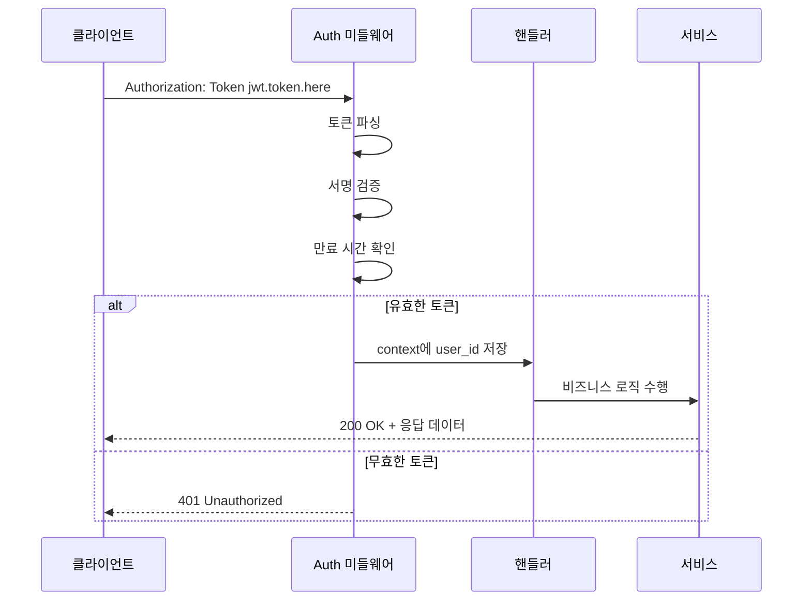

---

## 3. 데이터베이스 설계

### 3.1 ERD (Entity Relationship Diagram)

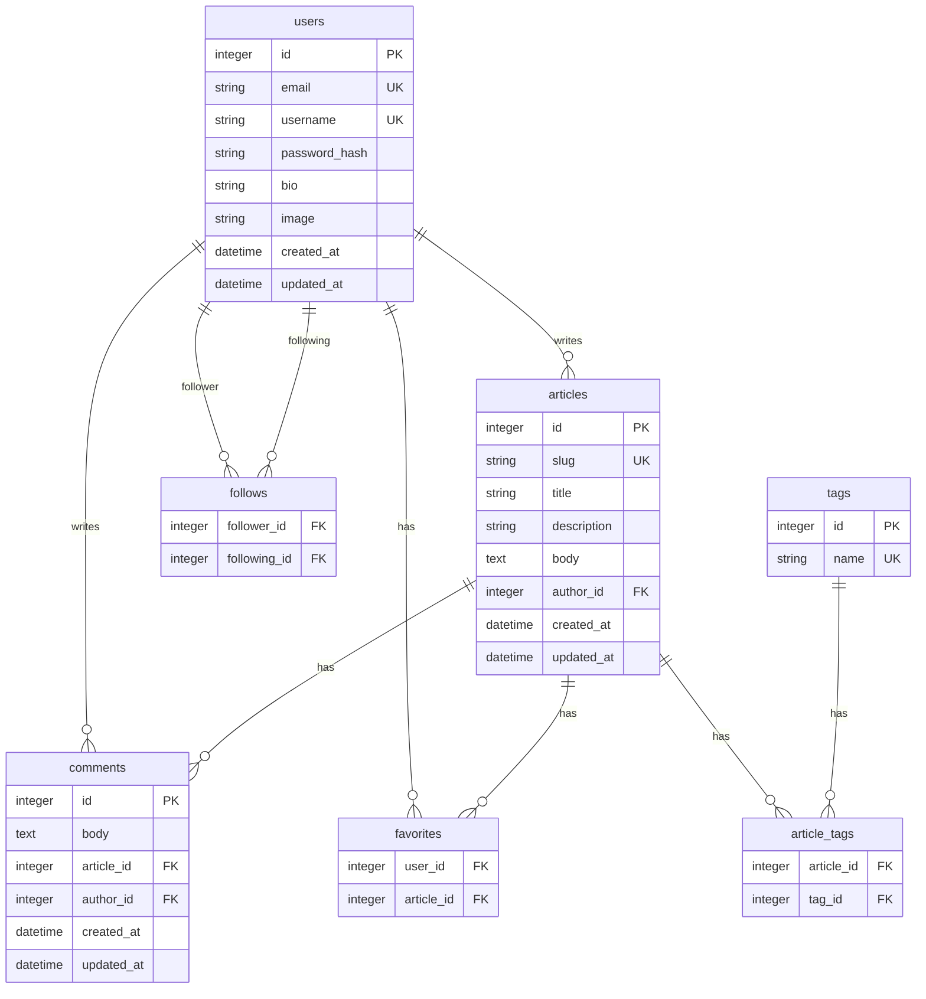

### 3.2 테이블 스키마

```sql
-- 사용자 테이블
CREATE TABLE users (
    id INTEGER PRIMARY KEY AUTOINCREMENT,
    email TEXT NOT NULL UNIQUE,
    username TEXT NOT NULL UNIQUE,
    password_hash TEXT NOT NULL,
    bio TEXT DEFAULT '',
    image TEXT DEFAULT '',
    created_at DATETIME DEFAULT CURRENT_TIMESTAMP,
    updated_at DATETIME DEFAULT CURRENT_TIMESTAMP
);

-- 게시글 테이블
CREATE TABLE articles (
    id INTEGER PRIMARY KEY AUTOINCREMENT,
    slug TEXT NOT NULL UNIQUE,
    title TEXT NOT NULL,
    description TEXT NOT NULL,
    body TEXT NOT NULL,
    author_id INTEGER NOT NULL,
    created_at DATETIME DEFAULT CURRENT_TIMESTAMP,
    updated_at DATETIME DEFAULT CURRENT_TIMESTAMP,
    FOREIGN KEY (author_id) REFERENCES users(id) ON DELETE CASCADE
);

-- 댓글 테이블
CREATE TABLE comments (
    id INTEGER PRIMARY KEY AUTOINCREMENT,
    body TEXT NOT NULL,
    article_id INTEGER NOT NULL,
    author_id INTEGER NOT NULL,
    created_at DATETIME DEFAULT CURRENT_TIMESTAMP,
    updated_at DATETIME DEFAULT CURRENT_TIMESTAMP,
    FOREIGN KEY (article_id) REFERENCES articles(id) ON DELETE CASCADE,
    FOREIGN KEY (author_id) REFERENCES users(id) ON DELETE CASCADE
);

-- 태그 테이블
CREATE TABLE tags (
    id INTEGER PRIMARY KEY AUTOINCREMENT,
    name TEXT NOT NULL UNIQUE
);

-- 게시글-태그 연결 테이블
CREATE TABLE article_tags (
    article_id INTEGER NOT NULL,
    tag_id INTEGER NOT NULL,
    PRIMARY KEY (article_id, tag_id),
    FOREIGN KEY (article_id) REFERENCES articles(id) ON DELETE CASCADE,
    FOREIGN KEY (tag_id) REFERENCES tags(id) ON DELETE CASCADE
);

-- 좋아요 테이블
CREATE TABLE favorites (
    user_id INTEGER NOT NULL,
    article_id INTEGER NOT NULL,
    PRIMARY KEY (user_id, article_id),
    FOREIGN KEY (user_id) REFERENCES users(id) ON DELETE CASCADE,
    FOREIGN KEY (article_id) REFERENCES articles(id) ON DELETE CASCADE
);

-- 팔로우 테이블
CREATE TABLE follows (
    follower_id INTEGER NOT NULL,
    following_id INTEGER NOT NULL,
    PRIMARY KEY (follower_id, following_id),
    FOREIGN KEY (follower_id) REFERENCES users(id) ON DELETE CASCADE,
    FOREIGN KEY (following_id) REFERENCES users(id) ON DELETE CASCADE
);

-- 인덱스
CREATE INDEX idx_articles_author_id ON articles(author_id);
CREATE INDEX idx_articles_created_at ON articles(created_at DESC);
CREATE INDEX idx_comments_article_id ON comments(article_id);
CREATE INDEX idx_article_tags_tag_id ON article_tags(tag_id);
```

---

## 4. API 설계

### 4.1 엔드포인트 개요

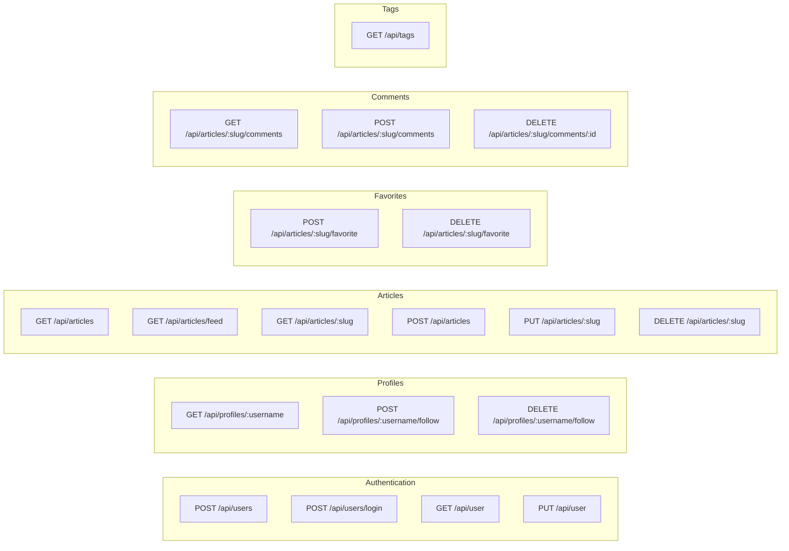

### 4.2 API 상세 명세

#### 인증 API

| Method | Endpoint | 설명 | 인증 | 요청 Body |
|--------|----------|------|------|-----------|
| POST | `/api/users` | 회원가입 | 불필요 | `{user: {username, email, password}}` |
| POST | `/api/users/login` | 로그인 | 불필요 | `{user: {email, password}}` |
| GET | `/api/user` | 현재 사용자 | 필수 | - |
| PUT | `/api/user` | 정보 수정 | 필수 | `{user: {email?, username?, password?, image?, bio?}}` |

#### 프로필 API

| Method | Endpoint | 설명 | 인증 |
|--------|----------|------|------|
| GET | `/api/profiles/:username` | 프로필 조회 | 선택 |
| POST | `/api/profiles/:username/follow` | 팔로우 | 필수 |
| DELETE | `/api/profiles/:username/follow` | 언팔로우 | 필수 |

#### 게시글 API

| Method | Endpoint | 설명 | 인증 | Query Parameters |
|--------|----------|------|------|------------------|
| GET | `/api/articles` | 목록 조회 | 선택 | `tag`, `author`, `favorited`, `limit`, `offset` |
| GET | `/api/articles/feed` | 피드 | 필수 | `limit`, `offset` |
| GET | `/api/articles/:slug` | 상세 조회 | 선택 | - |
| POST | `/api/articles` | 작성 | 필수 | - |
| PUT | `/api/articles/:slug` | 수정 | 필수 | - |
| DELETE | `/api/articles/:slug` | 삭제 | 필수 | - |

### 4.3 응답 형식

#### 성공 응답 예시

```json
// User 응답
{
  "user": {
    "email": "jake@jake.jake",
    "token": "jwt.token.here",
    "username": "jake",
    "bio": "I work at statefarm",
    "image": "https://api.realworld.io/images/smiley-cyrus.jpg"
  }
}

// Article 응답
{
  "article": {
    "slug": "how-to-train-your-dragon",
    "title": "How to train your dragon",
    "description": "Ever wonder how?",
    "body": "It takes a Jacobian",
    "tagList": ["dragons", "training"],
    "createdAt": "2016-02-18T03:22:56.637Z",
    "updatedAt": "2016-02-18T03:48:35.824Z",
    "favorited": false,
    "favoritesCount": 0,
    "author": {
      "username": "jake",
      "bio": "I work at statefarm",
      "image": "https://api.realworld.io/images/smiley-cyrus.jpg",
      "following": false
    }
  }
}
```

#### 에러 응답 형식

```json
{
  "errors": {
    "body": ["can't be empty"],
    "email": ["has already been taken"]
  }
}
```

| HTTP 코드 | 설명 |
|-----------|------|
| 401 | 인증 필요 |
| 403 | 권한 없음 |
| 404 | 리소스 없음 |
| 422 | 유효성 검사 실패 |

---

## 5. 프론트엔드 설계

### 5.1 디렉토리 구조

```
frontend/
├── src/
│   ├── components/
│   │   ├── layout/
│   │   │   ├── Header.tsx
│   │   │   ├── Footer.tsx
│   │   │   └── Layout.tsx
│   │   ├── article/
│   │   │   ├── ArticlePreview.tsx
│   │   │   ├── ArticleMeta.tsx
│   │   │   ├── ArticleContent.tsx
│   │   │   └── ArticleActions.tsx
│   │   ├── comment/
│   │   │   ├── CommentForm.tsx
│   │   │   └── CommentList.tsx
│   │   ├── profile/
│   │   │   ├── ProfileHeader.tsx
│   │   │   └── ProfileTabs.tsx
│   │   └── ui/                    # shadcn/ui 컴포넌트
│   │       ├── button.tsx
│   │       ├── input.tsx
│   │       └── ...
│   ├── pages/
│   │   ├── Home.tsx
│   │   ├── Login.tsx
│   │   ├── Register.tsx
│   │   ├── Settings.tsx
│   │   ├── Editor.tsx
│   │   ├── Article.tsx
│   │   └── Profile.tsx
│   ├── hooks/
│   │   ├── useAuth.ts
│   │   ├── useArticles.ts
│   │   └── useProfile.ts
│   ├── api/
│   │   ├── client.ts              # API 클라이언트
│   │   ├── auth.ts
│   │   ├── articles.ts
│   │   ├── comments.ts
│   │   ├── profiles.ts
│   │   └── tags.ts
│   ├── store/
│   │   └── authStore.ts           # Zustand 스토어
│   ├── types/
│   │   └── index.ts               # TypeScript 타입
│   ├── lib/
│   │   └── utils.ts               # 유틸리티 함수
│   ├── routes/
│   │   └── index.tsx              # TanStack Router 설정
│   ├── App.tsx
│   ├── main.tsx
│   └── index.css
├── public/
├── index.html
├── vite.config.ts
├── tailwind.config.js
├── tsconfig.json
└── package.json
```

### 5.2 컴포넌트 구조

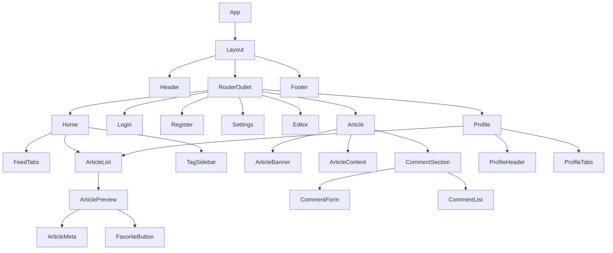

### 5.3 상태 관리

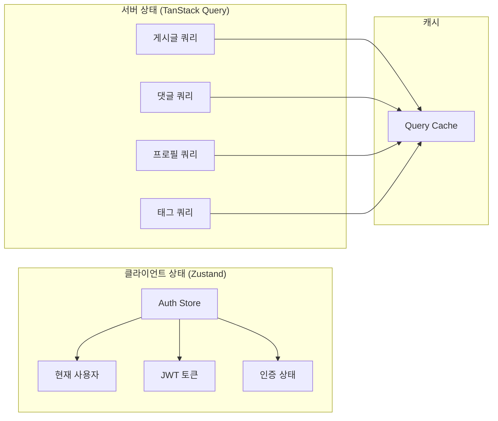

### 5.4 라우팅 구조

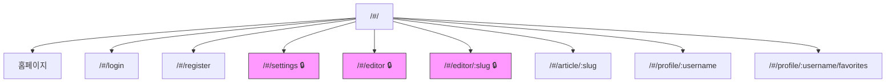

> 🔒 = 인증 필요

---

## 6. 보안 설계

### 6.1 인증 흐름

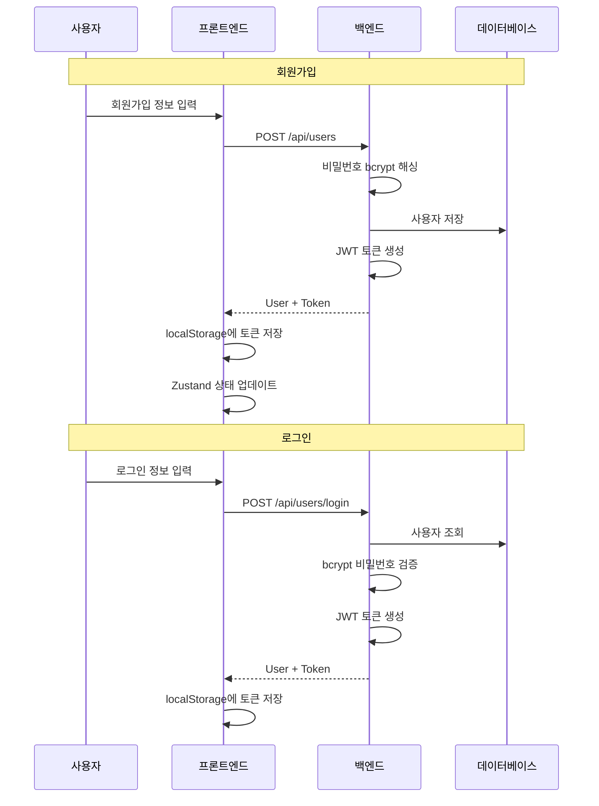

### 6.2 보안 고려사항

| 영역 | 구현 |
|------|------|
| 비밀번호 저장 | bcrypt 해싱 (cost factor: 10) |
| 토큰 | JWT with HS256, 만료 시간 설정 |
| CORS | 허용된 Origin만 접근 |
| SQL Injection | sqlc 사용 (Prepared Statements) |
| XSS | React 자동 이스케이프 |
| 권한 검증 | 핸들러에서 작성자 확인 |

---

## 7. 배포 아키텍처

### 7.1 Docker 구성

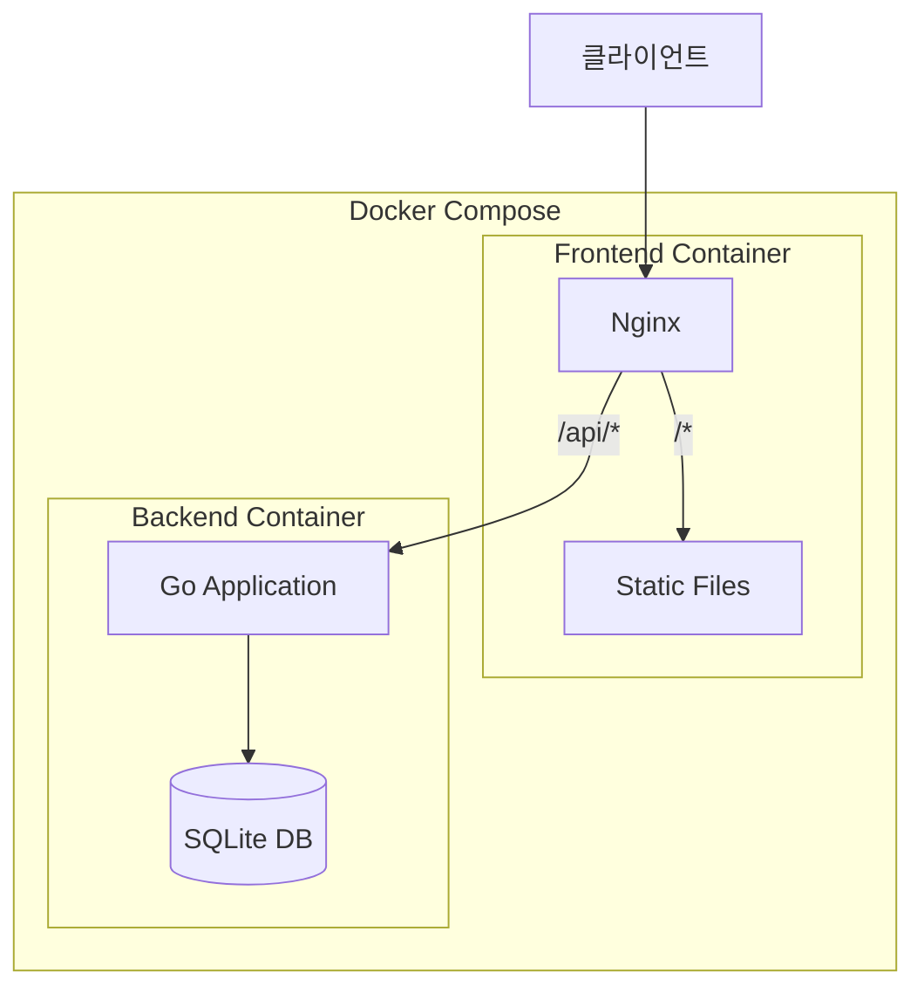

### 7.2 환경 변수

| 변수 | 설명 | 기본값 |
|------|------|--------|
| `PORT` | 백엔드 서버 포트 | 8080 |
| `JWT_SECRET` | JWT 서명 키 | - |
| `JWT_EXPIRY` | 토큰 만료 시간 | 24h |
| `DB_PATH` | SQLite 파일 경로 | ./data/realworld.db |
| `CORS_ORIGINS` | 허용된 Origin | http://localhost:5173 |

---

## 8. 참고 자료

- [RealWorld 공식 문서](https://realworld-docs.netlify.app/)
- [API 스펙](https://realworld-docs.netlify.app/specifications/backend/endpoints/)
- [Agentic Coding - Armin Ronacher](http://lucumr.pocoo.org/2025/6/12/agentic-coding/)
